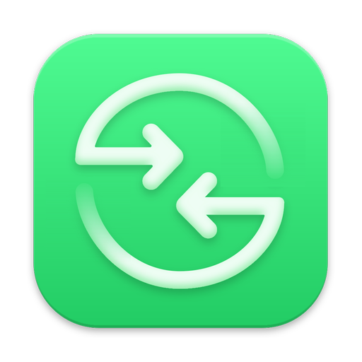
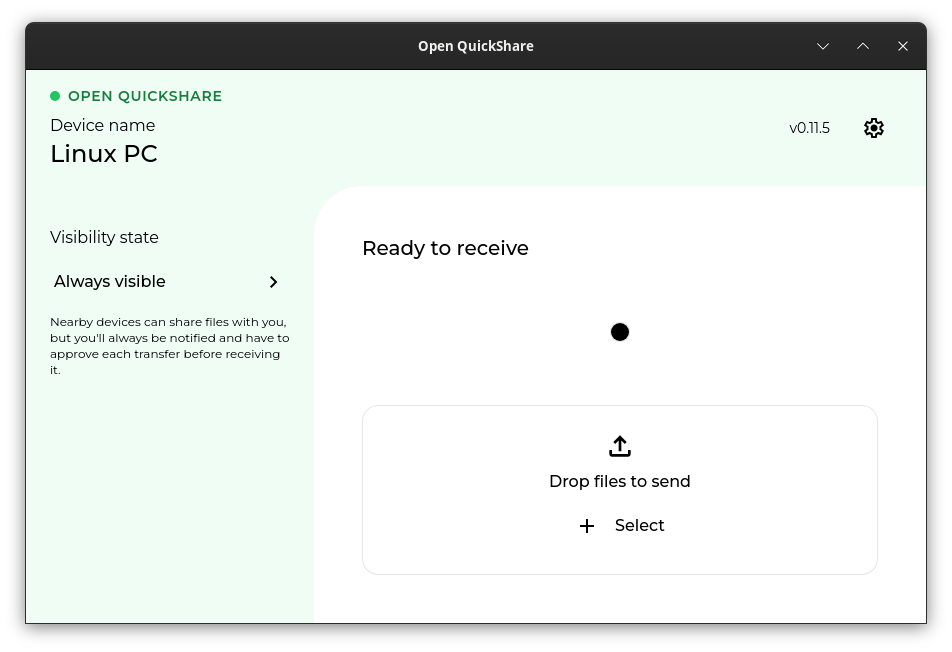

<div align="center">
  
  <h1>open-quickshare</h1>

  <p>
    <strong>Complete Quick Share for Linux — send & receive over Bluetooth LE, Wi‑Fi LAN and Wi‑Fi Direct. No shared network required.</strong>
  </p>
</div>

> Also known as **rquickshare-complete** — a complete implementation of the Quick Share
> protocol, based on [rquickshare](https://github.com/Martichou/rquickshare) by Martichou
> and the `ble-receiver` work of [martinalderson](https://github.com/martinalderson/rquickshare).
> The full git history (and therefore authorship) of both is preserved in this repository.
> Licensed GPL‑3, like the projects it builds on.

<div align="center">
  
</div>

Why "complete"
--------------------------

Quick Share (Google's AirDrop equivalent) doesn't run over a single transport. Google's own
clients negotiate across a *stack* of mediums: discovery and handshake over **Bluetooth LE**,
transfers over **L2CAP**, an automatic upgrade to **Wi‑Fi LAN** when both devices share a
network — and when they don't, one device **hosts a Wi‑Fi Direct group / hotspot** that the
other joins, so large files move at Wi‑Fi speed with no router and no internet anywhere in
sight.

Every other open implementation supports exactly one rung of that ladder: Wi‑Fi LAN via mDNS,
meaning both devices must already be on the same network. This project implements the entire
ladder, in **both directions**, matching the behavior of Google's own clients:

```
Same network?      ──yes→  transfer over Wi‑Fi LAN (fast, as always)
      │no
      └→  connect over BLE, handshake + PIN over BLE, then:
            ├─ peer offers Wi‑Fi LAN         → take it (it knew better)
            ├─ no shared network             → one side hosts a Wi‑Fi Direct
            │                                  group / hotspot, the other joins;
            │                                  transfer at Wi‑Fi speed
            └─ Wi‑Fi radio unavailable       → small payloads over BLE;
                                               large ones fail fast with guidance
```

Failures at any rung flip to the next automatically (with retries); pure BLE is the floor, so
a transfer degrades rather than dies. Mid‑transfer channel switches are lossless: the prior
channel is fully drained (`LAST_WRITE` / `SAFE_TO_CLOSE` in both directions) before the swap.

How it differs from every other implementation
--------------------------

| Capability | [rquickshare](https://github.com/Martichou/rquickshare) | [NearDrop](https://github.com/grishka/NearDrop)¹ | [pyquickshare](https://github.com/teaishealthy/pyquickshare) | **open‑quickshare** |
|---|:-:|:-:|:-:|:-:|
| Receive over Wi‑Fi LAN (mDNS) | ✅ | ✅ | ✅ | ✅ |
| Send over Wi‑Fi LAN (mDNS) | ✅ | ❌ | ✅ | ✅ |
| Receive over Bluetooth LE (no shared network) | ❌ | ❌ | ❌ | ✅ |
| **Send over Bluetooth LE** | ❌ | ❌ | ❌ | ✅ |
| Automatic BLE → Wi‑Fi LAN upgrade | ❌ | ❌ | ❌ | ✅ |
| Send with no shared network (join the phone's Wi‑Fi Direct group) | ❌ | ❌ | ❌ | ✅ |
| Receive with no shared network (host a hotspot for the sender) | ❌ | ❌ | ❌ | ✅ |
| Lossless mid‑transfer channel switching | ❌ | ❌ | ❌ | ✅ |

¹ NearDrop is a macOS receiver.

Compared to Google's official Quick Share
--------------------------

| Capability | Official (Windows / Android) | **open‑quickshare** |
|---|:-:|:-:|
| Runs on Linux | ❌ *(no official client exists)* | ✅ |
| Same‑network transfers (fast) | ✅ | ✅ |
| BLE discovery, handshake and PIN verification | ✅ | ✅ |
| Large files with **no shared network** (Wi‑Fi Direct / hotspot) | ✅ | ✅ |
| Small transfers over pure Bluetooth | ✅ | ✅ |
| Automatic network setup and teardown | ✅ | ✅ |
| "Contacts" / "Your devices" visibility | ✅ | ❌ *(bound to Google accounts; not possible for third parties — "Everyone" mode only)* |
| Auto‑enabling the phone's Wi‑Fi radio | ✅ *(the OS does it)* | ❌ *(the phone's radio must already be on; see Limitations)* |

The protocol details were reverse‑engineered against live captures and validated against
[google/nearby](https://github.com/google/nearby) (bloom filters, advertisement layouts,
bandwidth‑upgrade frames — including the dynamic role negotiation that Quick Share for
Windows uses).

Requirements
--------------------------

- Linux with **BlueZ 5.x** (Bluetooth LE, L2CAP CoC) — the new capabilities are Linux‑only;
  macOS remains as upstream (Wi‑Fi LAN).
- **NetworkManager** — used to host/join Wi‑Fi Direct groups and hotspots for the
  no‑shared‑network paths (`nmcli`).
- If **firewalld** is active, receiving large files with no shared network needs one
  permanent rule so the sender can reach the hosted hotspot:
  `sudo firewall-cmd --zone=nm-shared --add-port=61812/tcp --permanent && sudo firewall-cmd --reload`
  (Quick Share for Windows registers the equivalent firewall exception in its installer.)

Limitations
--------------------------

- **Tested only against Pixel phones** (Pixel 9 Pro, GmsCore as of Aug 2026). Other Android
  devices speak the same protocol and should work, but are unverified. Samsung devices ship a
  modified Quick Share and may behave differently.
- **The phone's Wi‑Fi radio must be enabled** for large no‑network transfers (it does *not*
  need to be connected to anything). With the radio fully off, Android refuses all Wi‑Fi
  upgrades and only small payloads (≈1 MB) are accepted over pure BLE — the same wall the
  official clients hit, which they dodge by auto‑enabling the radio from inside the OS.
- **"Everyone" visibility only.** Contacts / Your‑devices modes require Google‑account
  certificate exchange that a third‑party client cannot perform.
- **Hosting a hotspot can briefly take the PC's Wi‑Fi off its network** (single‑channel
  radios); NetworkManager restores the previous connection when the transfer ends. Wired
  machines are unaffected throughout.
- Environment toggles: `PACKET_BLE_SEND=off` disables BLE sending, `PACKET_PREFER_BLE=on`
  forces BLE‑only discovery (testing), `PACKET_BLE_L2CAP=off` disables the L2CAP listener.
- Diagnostic tools live in `core_lib/examples/` (`tx_probe` — scan/decode/dial a receiver,
  `tx_send` — full command‑line send).

Installation
--------------------------

Download the latest **deb**, **rpm**, or **AppImage** from the
[Releases](https://github.com/ignotusbucius/open-quickshare/releases) page.

```bash
# Debian / Ubuntu
sudo dpkg -i open-quickshare_*_amd64.deb
# Fedora / RHEL
sudo rpm -i open-quickshare-*.x86_64.rpm
# AppImage (no install)
chmod +x open-quickshare_*.AppImage && ./open-quickshare_*.AppImage
```

Requires the GTK/WebKit runtime (`libwebkit2gtk-4.1`, `libayatana-appindicator3`); the
packages pull these in, or install them from your distro if the AppImage complains.

To send large files with no shared network, allow the hosted‑hotspot port once (see the
firewalld note under Requirements).

<details>
<summary>Build from source</summary>

```bash
git clone https://github.com/ignotusbucius/open-quickshare
cd open-quickshare/app/main
pnpm install
pnpm build          # produces deb / rpm / AppImage under src-tauri/target/release/bundle/
```

The library that implements the whole protocol stack is `core_lib` (crate `rqs_lib`);
`cargo build --release` inside it builds just the library.
</details>

### Frontends

Two frontends drive the same `rqs_lib`, so both get every capability above:

- **Open QuickShare** — the desktop app in this repository (`app/main`, Tauri + Vue), what the
  releases ship and the screenshot shows.
- **[Packet](https://github.com/nozwock/packet)** — a GTK app that integrates `rqs_lib` via a
  Cargo `[patch]`.

<details>
<summary>Upstream rquickshare releases (Wi‑Fi LAN only)</summary>

The original installation channels for the upstream app: `.deb`, `.rpm`, AppImage, Snap from
[rquickshare releases](https://github.com/Martichou/rquickshare/releases), AUR
(`r-quick-share`), and [NixOS](https://search.nixos.org/packages?query=rquickshare). These do
not include the BLE / Wi‑Fi Direct stack.
</details>

FAQ
--------------------------

### My Android device doesn't see my laptop

With this implementation it should appear even with no shared network — make sure Bluetooth
is enabled on both sides. On a shared network, mDNS must be allowed (public networks often
block it); the BLE path doesn't care.

### My laptop doesn't see my Android device (when sending)

Put the phone on its Quick Share receive screen ("Everyone" visibility). The phone is then
discovered over BLE even without mDNS. Android also sometimes hides its mDNS service; this
project's Bluetooth advertisement nudges it awake — with Bluetooth off on the laptop you're
limited to mDNS and the same-network requirement.

### A large transfer says "Too large for Bluetooth — turn on Wi‑Fi"

The phone's Wi‑Fi radio is off, so no Wi‑Fi upgrade is possible (see Limitations). Enable
Wi‑Fi on the phone — it does *not* need to join any network — and retry.

### My firewall is blocking the connection

For same‑network transfers you can pin the app's port in
`~/.local/share/dev.mandre.rquickshare/.settings.json` (`"port": 12345`) and allow it. For
hosted‑hotspot receiving, see the firewalld rule under Requirements.

Credits
--------------------------

This project exists because of:

- [Martichou/rquickshare](https://github.com/Martichou/rquickshare) — the base implementation (Wi‑Fi LAN, Ukey2, the whole foundation)
- [martinalderson/rquickshare `ble-receiver`](https://github.com/martinalderson/rquickshare) — the first connect‑over‑BLE receiver
- [nozwock/packet](https://github.com/nozwock/packet) — the GTK app this stack is exercised in
- [google/nearby](https://github.com/google/nearby) — protocol ground truth
- [grishka/NearDrop](https://github.com/grishka/NearDrop) and [vicr123/QNearbyShare](https://github.com/vicr123/QNearbyShare) — upstream's original protocol references

Contributing
--------------------------

Pull requests are welcome. For major changes, please open an issue first to discuss what you
would like to change. Reports from non‑Pixel devices are especially valuable (see
Limitations).
