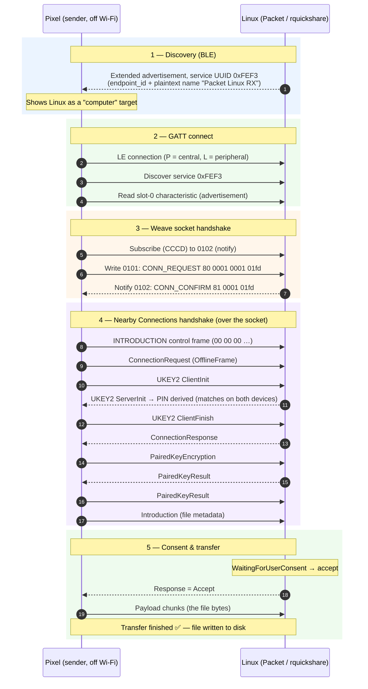
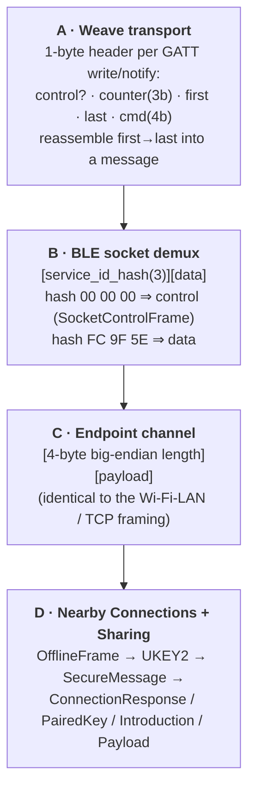
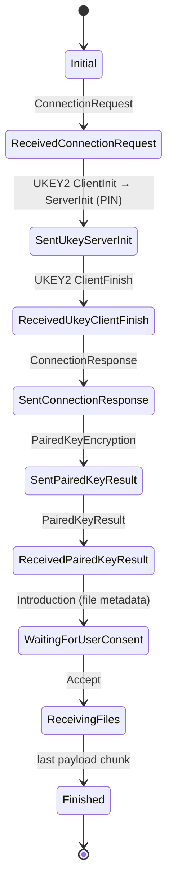
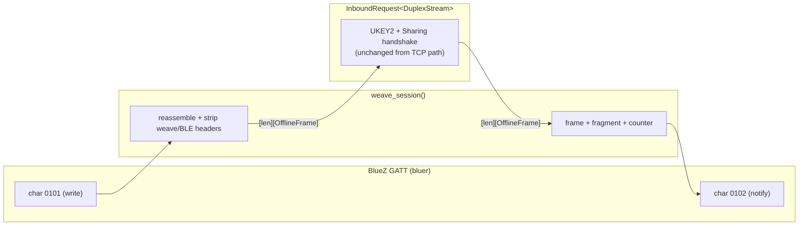

# Quick Share over Bluetooth — BLE receiver discovery & the weave data socket

> Reverse-engineered and implemented against a **Pixel 9 Pro** (Android, July 2026).
> This document describes how a Linux device (rquickshare / Packet) can be
> discovered and **receive a file over Bluetooth** from a phone that has dropped
> off Wi-Fi during Quick Share — the scenario that previously failed
> ([nozwock/packet#140](https://github.com/nozwock/packet/issues/140),
> [Martichou/rquickshare#425](https://github.com/Martichou/rquickshare/issues/425)).
>
> **Status:** working prototype — a real photo transfers end-to-end. See
> [Limitations & performance](#limitations--performance) for what's left.

---

## 1. The problem

Quick Share (Nearby Share) chooses the connection transport by **the medium it
discovered the peer on**, in a fixed priority order:

```
AWDL > WIFI_LAN > WIFI_DIRECT > WIFI_HOTSPOT > WEB_RTC > BLUETOOTH > BLE
```

Historically rquickshare/Packet only implemented the **Wi-Fi LAN** medium: it
advertises an mDNS service (`_FC9F5ED42C8A._tcp`) and accepts a TCP connection.
That works only when the phone discovers it **over mDNS**, i.e. while the phone
is on the same Wi-Fi network.

Google's *AirDrop-compatibility* update changed Pixel behaviour: when you open
the share sheet, the phone **disconnects from Wi-Fi** to do Quick Share / AirDrop
discovery over Bluetooth. While off Wi-Fi it can't see the mDNS service, so the
Linux box never appears as a target — and even if selected later, the phone only
holds a **BLE** endpoint for it, so it will only ever try to connect over BLE.

**Fixing it therefore requires implementing the Bluetooth path end-to-end:**
BLE discovery, a GATT server, and the Nearby Connections **"weave" data socket**
over which the encrypted transfer runs. No open-source project had done this;
this is the result.

---

## 2. End-to-end sequence



---

## 3. Protocol stack

Every message the phone sends over the socket is wrapped in four nested layers.
Reading top-to-bottom is receive; the reverse is send.



The crucial reuse win: once the socket is up, **layer C is byte-for-byte the same
`[len][OfflineFrame]` stream that rquickshare already speaks over TCP** — so the
entire existing receive state machine runs unmodified over Bluetooth.

---

## 4. Byte-level reference

### 4.1 BLE advertisement (service data under UUID `0xFEF3`)

The advertised service data is a Nearby Connections *mediums* `BleAdvertisement`
carrying an inner *connections* advertisement, carrying the endpoint info:

```
BleAdvertisement (mediums)
  48                      version=2 | socket_version=2 | fast=0
  fc 9f 5e                service_id_hash = SHA-256("NearbySharing")[0:3]
  00 00 00 NN             DATA_SIZE (u32, big-endian)
  <DATA>                  ── connections advertisement ──
    23                    version=1 | PCP=3 (PointToPoint)
    fc 9f 5e              service_id_hash
    E0 E1 E2 E3           endpoint_id (4 bytes, MUST match the mDNS name)
    26                    endpoint_info size
    <endpoint_info>       ── Nearby Share application advertisement ──
      26                  header: version=1 | visible(0) | device_type=laptop(3)
      <16 bytes>          salt(2) + metadata-key hash(14)
      LL                  device-name length
      <name>              UTF-8 plaintext name  (visible/"Everyone" mode)
    <6+2 bytes>           bluetooth MAC + extra
  <trailer>              device_token(2) + Nearby-Presence data elements
```

The **same `endpoint_id`** is used in the mDNS instance name so Wi-Fi and BLE
resolve to one endpoint:
`mdns_name = base64url( 0x23 ‖ endpoint_id ‖ FC 9F 5E ‖ 00 00 )`.

### 4.2 GATT service `0xFEF3`

| Characteristic UUID | Props | Direction | Purpose |
|---|---|---|---|
| `00000000-0000-3000-8000-000000000000` | Read | L→P | advertisement slot 0 (full `BleAdvertisement`) |
| `00000100-0004-1000-8000-001a11000101` | **Write (with response)** | P→L | weave "ToPeripheral" — phone writes packets |
| `00000100-0004-1000-8000-001a11000102` | **Notify** (+CCCD) | L→P | weave "FromPeripheral" — we notify packets |

> Write-with-response (not write-without-response) is deliberate: it forces the
> phone to send one packet at a time so BlueZ delivers them **in order**
> (see [Limitations](#limitations--performance)).

### 4.3 Weave packet header (layer A)

```
 bit  7   6 5 4    3       2      1 0
     ┌───┬───────┬───────┬──────┬───────┐
     │ C │counter│ first │ last │  cmd  │      (cmd only meaningful when C=1)
     └───┴───────┴───────┴──────┴───────┘
  C=1 control · C=0 data      first=0x08  last=0x04
  cmd: 0 = CONNECTION_REQUEST   1 = CONNECTION_CONFIRM   2 = ERROR
```

| Packet | Bytes |
|---|---|
| CONNECTION_REQUEST (from phone) | `80` `min_ver(2)` `max_ver(2)` `max_pkt_size(2)` → e.g. `80 0001 0001 01fd` |
| CONNECTION_CONFIRM (our reply)  | `81` `sel_ver(2)` `sel_pkt_size(2)` → e.g. `81 0001 01fd` |
| DATA                            | header with first/last flags, then the layer-B bytes |

### 4.4 BLE socket packets (layer B) & control frames

```
data:     [fc 9f 5e][ layer-C bytes … ]
control:  [00 00 00][ SocketControlFrame protobuf ]
            08 01 …  ⇒ INTRODUCTION   (service_id_hash, socket_version)
            08 02 …  ⇒ DISCONNECTION
```

The receiver reads (and skips) the leading **INTRODUCTION**, then feeds every
subsequent data message's `[len][OfflineFrame]` straight into the existing
handshake.

---

## 5. Inbound state machine (unchanged core, over a new transport)



> **Tolerance fix:** newer Pixels interleave extra frames (including an unhandled
> outer `OfflineFrame` with `type = 12`) before the Introduction. The
> `ReceivedPairedKeyResult` state now *waits* for a frame that actually contains
> an `introduction` instead of erroring on the first non-introduction frame.

---

## 6. Implementation

All changes live in `core_lib`:

| File | Change |
|---|---|
| `src/hdl/blea.rs` | `receiver_service_data()` builds the 0xFEF3 advertisement; `ReceiverAdvertiser` advertises it (extended, connectable). |
| `src/hdl/gatt.rs` *(new)* | `ReceiverGattServer`: serves the 0xFEF3 GATT service (slot-0 read + weave `0101`/`0102`) and `weave_session()`, which does the weave handshake and bridges the socket to `InboundRequest` via an in-memory `tokio::io::duplex`. |
| `src/hdl/inbound.rs` | `InboundRequest<S>` made generic over any `AsyncRead + AsyncWrite` (was `TcpStream`); introduction-tolerance fix. |
| `src/utils.rs` | `stream_read_exact` generalized over `AsyncRead`. |
| `src/lib.rs` | `RQS::run()` spawns `ReceiverGattServer` + `ReceiverAdvertiser` (sharing one endpoint_id and advertisement) when visible. |
| `examples/rx_service.rs` | Standalone receive harness (auto-accepts, logs the flow) used to develop/verify this. |

The bridge in one picture:



---

## 7. Limitations & performance

- **Speed.** BLE is inherently slow, and **write-with-response** (used for
  ordering) adds a round-trip per packet, so throughput is low (tens of KB/s).
  The proper fix for large files is a **bandwidth upgrade to Wi-Fi-LAN**: once the
  encrypted session is up, send a `BANDWIDTH_UPGRADE_NEGOTIATION /
  UPGRADE_PATH_AVAILABLE` frame with our `ip_address` + `wifi_port`; the phone
  reconnects to the existing TCP listener and streams the payload over Wi-Fi with
  the **same** UKEY2 keys. The BLE socket only carries the handshake.
  (Alternatively, replace write-with-response with software packet reordering
  keyed on the weave counter to recover some speed while keeping BLE-only.)
- **Re-advertising.** A connectable advertisement is consumed by one connection;
  the receiver must re-advertise after each disconnect (currently the harness is
  restarted per transfer, and repeated failed attempts can wedge the phone until
  a Bluetooth reset).
- **Single connection.** `weave_session` holds one shared packet channel /
  notifier; concurrent/repeat connections need per-connection state.
- **Prototype logging.** Verbose `rx pkt` / `rx msg` / `-> inbound` debug lines
  should be removed or gated for production.

---

## 8. References

- `google/nearby` — `connections/implementation/mediums/ble/*`,
  `internal/weave/packet.{h,cc}`, `connections/implementation/offline_frames.cc`,
  the Apple `.../Mediums/BLE/Sockets/` weave client.
- [grishka/NearDrop](https://github.com/grishka/NearDrop) `PROTOCOL.md` (mDNS/TCP
  receiver reference; documents the advertisement format).
- Issues: [nozwock/packet#140](https://github.com/nozwock/packet/issues/140),
  [Martichou/rquickshare#425](https://github.com/Martichou/rquickshare/issues/425).
